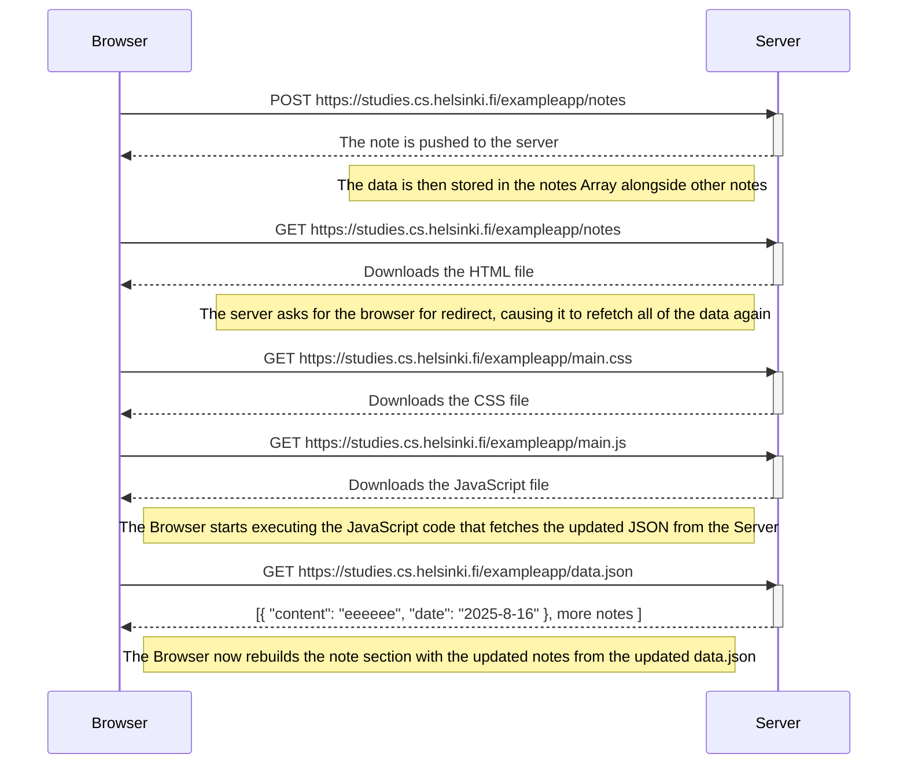

```mermaid
sequenceDiagram
    participant Browser
    participant Server

    Browser->>Server: POST https://studies.cs.helsinki.fi/exampleapp/notes
    activate Server
    Server-->>Browser: The note is pushed to the server
    deactivate Server

    Note left of Server: The data is then stored in the notes Array alongside other notes

    Browser->>Server: GET https://studies.cs.helsinki.fi/exampleapp/notes
    activate Server
    Server-->>Browser: Downloads the HTML file
    deactivate Server

    Note left of Server: The server asks for the browser for redirect, causing it to refetch all of the data again

    Browser->>Server: GET https://studies.cs.helsinki.fi/exampleapp/main.css
    activate Server
    Server-->>Browser: Downloads the CSS file
    deactivate Server

    Browser->>Server: GET https://studies.cs.helsinki.fi/exampleapp/main.js
    activate Server
    Server-->>Browser: Downloads the JavaScript file
    deactivate Server

    Note right of Browser: The Browser starts executing the JavaScript code that fetches the updated JSON from the Server

    Browser->>Server: GET https://studies.cs.helsinki.fi/exampleapp/data.json
    activate Server
    Server-->>Browser: [{ "content": "eeeeee", "date": "2025-8-16" }, more notes ]
    deactivate Server

    Note right of Browser: The Browser now rebuilds the note section with the updated notes from the updated data.json
```
