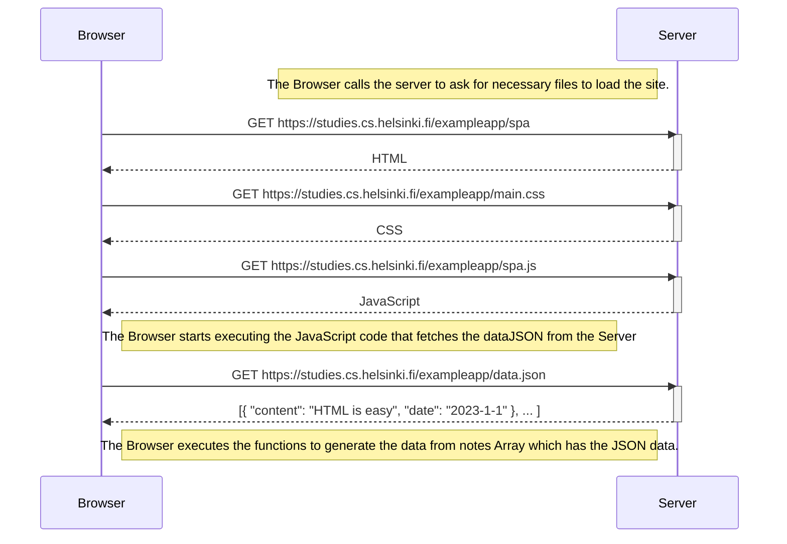

```mermaid
    sequenceDiagram
        participant Browser
        participant Server


        Note left of Server: The Browser calls the server to ask for necessary files to load the site.

        Browser->>Server: GET https://studies.cs.helsinki.fi/exampleapp/spa
        activate Server
        Server-->>Browser: HTML
        deactivate Server

        Browser->>Server: GET https://studies.cs.helsinki.fi/exampleapp/main.css
        activate Server
        Server-->>Browser: CSS
        deactivate Server

        Browser->>Server: GET https://studies.cs.helsinki.fi/exampleapp/spa.js
        activate Server
        Server-->>Browser: JavaScript
        deactivate Server

        Note right of Browser: The Browser starts executing the JavaScript code that fetches the dataJSON from the Server

        Browser->>Server: GET https://studies.cs.helsinki.fi/exampleapp/data.json
        activate Server
        Server-->>Browser: [{ "content": "HTML is easy", "date": "2023-1-1" }, ... ]
        deactivate Server

        Note right of Browser: The Browser executes the functions to generate the data from notes Array which has the JSON data.
```
