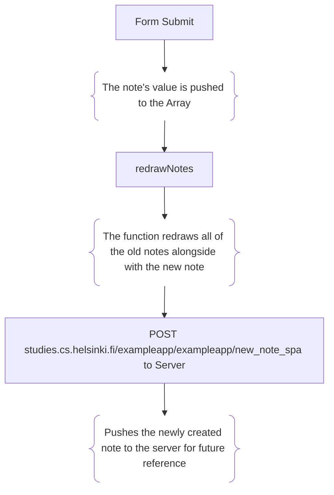

```mermaid
    flowchart TD
        Step1[Form Submit] --> A@{ shape: braces, label: "The note's value is pushed to the Array" } --> Step2[redrawNotes] --> B@{ shape: braces, label: "The function redraws all of the old notes alongside with the new note" } --> Step3[POST studies.cs.helsinki.fi/exampleapp/exampleapp/new_note_spa to Server] -->
        C@{ shape: braces, label: "Pushes the newly created note to the server for future reference" }

```
